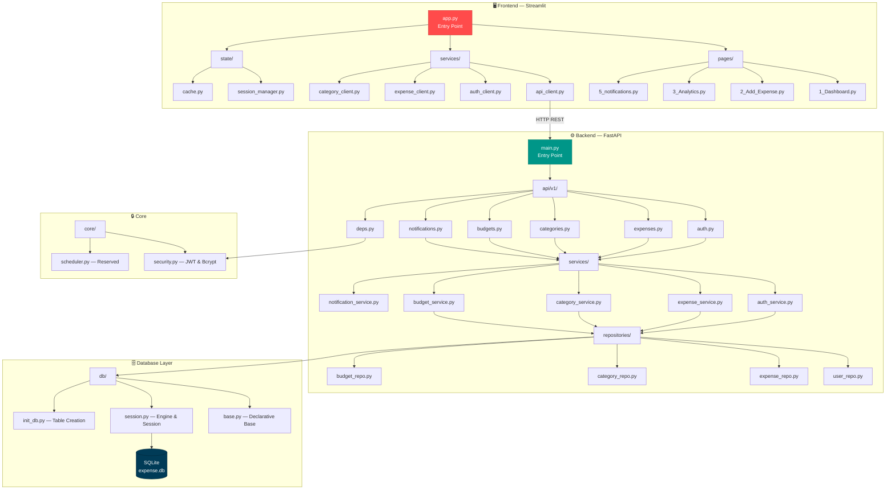
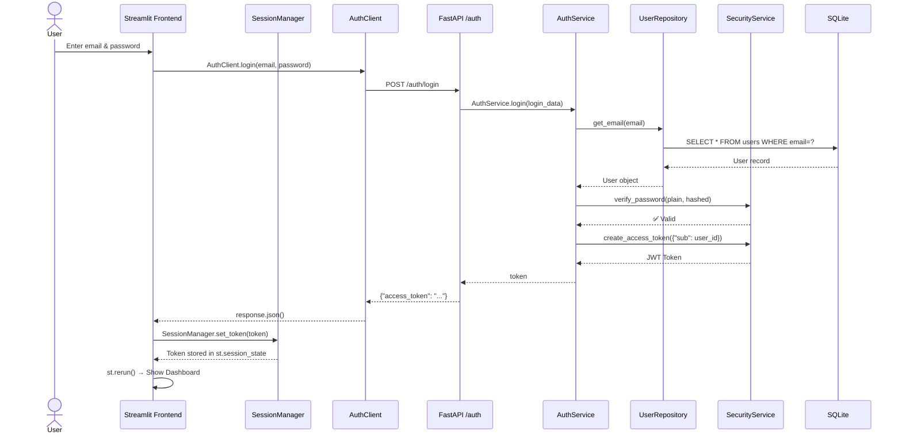
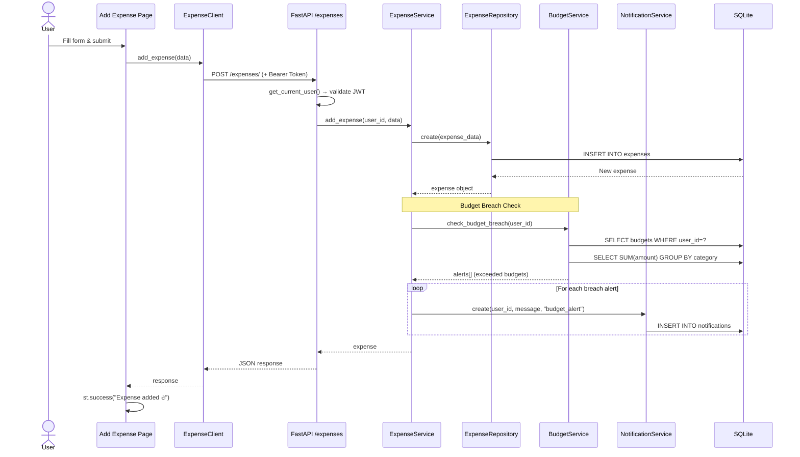
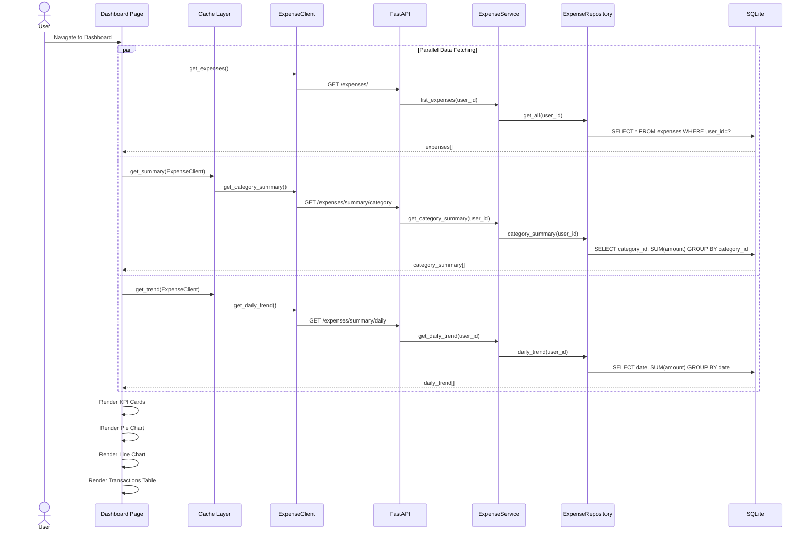
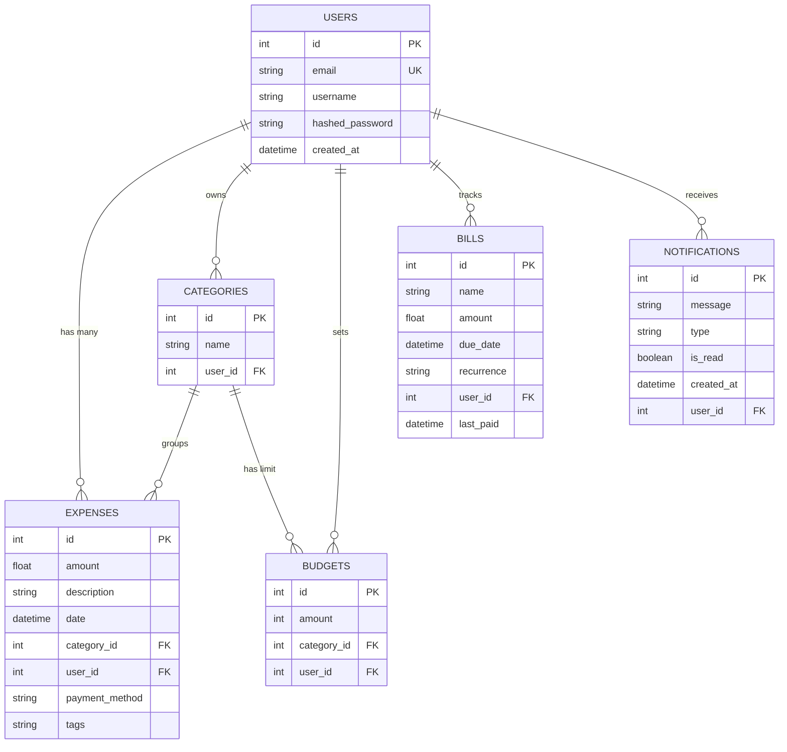

<div align="center">

# 💰 Expense Tracker

### A Full-Stack Personal Finance Management Application

[](https://python.org)
[](https://fastapi.tiangolo.com)
[](https://streamlit.io)
[](https://sqlalchemy.org)
[](https://sqlite.org)
[](LICENSE)

*Track expenses, set budgets, visualize spending patterns, and receive smart alerts — all in one place.*

---

[Features](#-features) · [Architecture](#-architecture) · [Getting Started](#-getting-started) · [API Reference](#-api-reference) · [Modules](#-module-documentation)

</div>

---

## ✨ Features

| Feature | Description |
|---------|-------------|
| 🔐 **Authentication** | Secure user registration & login with JWT tokens and bcrypt password hashing |
| 💸 **Expense Management** | Add, list, and filter expenses by date range and category |
| 📂 **Categories** | Create, list, and delete custom spending categories per user |
| 📊 **Budget Tracking** | Set per-category budgets with automatic breach detection |
| 🔔 **Smart Notifications** | Auto-generated alerts when spending exceeds budget limits |
| 📈 **Analytics Dashboard** | Interactive pie charts, line charts, and KPI cards |
| 🗓️ **Trend Analysis** | Daily and monthly spending trend summaries |
| ⚡ **Caching** | Streamlit cache layer for optimized API calls (60s TTL) |

---

## 🏗️ Architecture

### High-Level System Architecture



### 📦 Project Structure

```
expense_tracker/
├── 📄 pyproject.toml              # Project metadata & dependencies
├── 📄 .python-version             # Python 3.13
├── 📄 LICENSE                     # GPL v3
│
├── 🖥️  frontend/                   # Streamlit UI Application
│   ├── app.py                     # Entry point — auth gates & navigation
│   ├── components/
│   │   ├── cards.py               # KPI metric cards
│   │   └── charts.py             # ECharts pie & line charts
│   ├── pages/
│   │   ├── 1_Dashboard.py         # Main dashboard with KPIs & charts
│   │   ├── 2_Add_Expense.py       # Expense submission form
│   │   ├── 3_Analytics.py         # Category breakdown analytics
│   │   └── 5_notifications.py     # Notification center
│   ├── services/
│   │   ├── api_client.py          # Base HTTP client with auth headers
│   │   ├── auth_client.py         # Login & registration API calls
│   │   ├── expense_client.py      # Expense CRUD API calls
│   │   └── category_client.py     # Category API calls
│   └── state/
│       ├── session_manager.py     # Streamlit session token management
│       └── cache.py               # Cached API responses (TTL=60s)
│
└── ⚙️  backend/                    # FastAPI REST API
    └── app/
        ├── main.py                # FastAPI app, startup & router registration
        ├── api/
        │   ├── deps.py            # Dependency injection (auth guard)
        │   └── v1/
        │       ├── auth.py        # POST /auth/register, /auth/login
        │       ├── expenses.py    # CRUD + summaries for expenses
        │       ├── categories.py  # CRUD for categories
        │       ├── budgets.py     # Budget management & alerts
        │       └── notifications.py # Notification retrieval
        ├── core/
        │   ├── security.py        # Password hashing, JWT encode/decode
        │   └── scheduler.py       # Placeholder for scheduled tasks
        ├── db/
        │   ├── base.py            # SQLAlchemy declarative base
        │   ├── session.py         # Engine, SessionLocal, get_db()
        │   └── init_db.py         # Auto-create all tables on startup
        ├── models/
        │   ├── user.py            # User table
        │   ├── expense.py         # Expense table
        │   ├── category.py        # Category table
        │   ├── budget.py          # Budget table
        │   ├── bill.py            # Bill / recurring payment table
        │   └── notification.py    # Notification table
        ├── repositories/
        │   ├── user_repo.py       # User DB operations
        │   ├── expense_repo.py    # Expense queries & aggregations
        │   ├── category_repo.py   # Category DB operations
        │   └── budget_repo.py     # Budget DB operations
        ├── schemas/
        │   ├── user.py            # Pydantic: UserCreate, UserLogin, TokenResponse
        │   └── expense.py         # Pydantic: ExpenseCreate
        └── services/
            ├── auth_service.py        # Registration & login logic
            ├── expense_service.py     # Expense logic + budget breach check
            ├── category_service.py    # Category business logic
            ├── budget_service.py      # Budget threshold logic
            └── notification_service.py # Notification CRUD
```

---

## 🔄 Data Flow Diagrams

### 1. User Authentication Flow



### 2. Add Expense & Budget Alert Flow



### 3. Dashboard Data Loading Flow



### 4. Complete Request Lifecycle

```mermaid
graph LR
    A["🧑 User Action"] --> B["📱 Streamlit Page"]
    B --> C["🔌 Service Client"]
    C --> D["📡 HTTP Request"]
    D --> E["🛡️ Auth Guard<br/>(deps.py)"]
    E --> F["🛣️ API Route<br/>(v1/*.py)"]
    F --> G["⚙️ Service Layer"]
    G --> H["🗃️ Repository"]
    H --> I["🗄️ SQLAlchemy ORM"]
    I --> J[("💾 SQLite DB")]
    J --> I
    I --> H
    H --> G
    G --> F
    F --> D
    D --> C
    C --> B
    B --> A

    style A fill:#667eea,stroke:#5a67d8,color:#fff
    style E fill:#f56565,stroke:#e53e3e,color:#fff
    style J fill:#003B57,stroke:#002635,color:#fff
    style G fill:#48bb78,stroke:#38a169,color:#fff
```



---

## 🗃️ Database Schema



---

## 📖 Module Documentation

### Backend Modules

#### 🔹 `backend/app/main.py` — Application Entry Point
The FastAPI application factory. Initializes the database on startup via `init_db()` and registers all v1 API routers (auth, expenses, categories).

#### 🔹 `backend/app/core/security.py` — Security Service
Centralized security utilities:
| Method | Purpose |
|--------|---------|
| `hash_password(password)` | Bcrypt hash generation |
| `verify_password(plain, hashed)` | Bcrypt hash verification |
| `create_access_token(data)` | JWT creation (HS256, 24h expiry) |
| `decode_access_token(token)` | JWT decoding & validation |

#### 🔹 `backend/app/api/deps.py` — Dependency Injection
Provides `get_current_user()` — a FastAPI dependency that extracts the Bearer token, decodes the JWT, and returns the authenticated `User` object. Used as a guard on all protected endpoints.

#### 🔹 `backend/app/db/` — Database Layer
| File | Role |
|------|------|
| `base.py` | Exports the SQLAlchemy `declarative_base()` instance |
| `session.py` | Creates the SQLite engine, `SessionLocal` factory, and `get_db()` generator |
| `init_db.py` | Imports all models and runs `Base.metadata.create_all()` on startup |

#### 🔹 `backend/app/models/` — ORM Models
Six SQLAlchemy models mapped to database tables:

| Model | Table | Key Fields |
|-------|-------|------------|
| `User` | `users` | id, email, username, hashed_password, created_at |
| `Expense` | `expenses` | id, amount, description, date, category_id, user_id, payment_method, tags |
| `Category` | `categories` | id, name, user_id |
| `Budget` | `budgets` | id, amount, category_id, user_id |
| `Bill` | `bills` | id, name, amount, due_date, recurrence, user_id, last_paid |
| `Notification` | `notifications` | id, message, type, is_read, created_at, user_id |

#### 🔹 `backend/app/repositories/` — Data Access Layer
The repository pattern abstracts all database queries:

| Repository | Key Methods |
|------------|-------------|
| `UserRepository` | `get_email(email)`, `create(user_data)` |
| `ExpenseRepository` | `create()`, `get_all()`, `filter()`, `category_summary()`, `daily_trend()`, `get_monthly_summary()` |
| `CategoryRepository` | `create()`, `get_by_user()`, `delete()` |
| `BudgetRepository` | `create_or_update()`, `get_by_user()` |

#### 🔹 `backend/app/schemas/` — Pydantic Validation
| Schema | Fields |
|--------|--------|
| `UserCreate` | email (EmailStr), username, password |
| `UserLogin` | email (EmailStr), password |
| `TokenResponse` | access_token, token_type="bearer" |
| `ExpenseCreate` | amount, description?, category_id, date?, payment_method?, tags? |

#### 🔹 `backend/app/services/` — Business Logic Layer
| Service | Responsibility |
|---------|---------------|
| `AuthService` | User registration (with duplicate check) & login (with password verification + JWT generation) |
| `ExpenseService` | Expense CRUD, triggers budget breach checks, auto-creates notifications on overspend |
| `CategoryService` | Category creation, listing, and deletion per user |
| `BudgetService` | Budget upsert, compares actual spend vs. budget limits to detect breaches |
| `NotificationService` | Creates and retrieves user notifications ordered by recency |

#### 🔹 `backend/app/api/v1/` — API Routes
| Router | Endpoints |
|--------|-----------|
| `auth.py` | `POST /auth/register`, `POST /auth/login` |
| `expenses.py` | `POST /expenses/`, `GET /expenses/`, `GET /expenses/filter`, `GET /expenses/summary/category`, `GET /expenses/summary/daily`, `GET /expenses/summary/monthly` |
| `categories.py` | `POST /categories/`, `GET /categories/`, `DELETE /categories/{id}` |
| `budgets.py` | `POST /budgets/`, `GET /budgets/alerts` |
| `notifications.py` | `GET /notifications/` |

---

### Frontend Modules

#### 🔸 `frontend/app.py` — Streamlit Entry Point
The main application file that handles:
- **Authentication gating**: Shows Login/Register tabs if unauthenticated
- **Navigation sidebar**: Links to Dashboard, Add Expense, Analytics pages
- **Logout**: Clears session state and triggers a rerun

#### 🔸 `frontend/components/` — Reusable UI Components

| Component | Function | Description |
|-----------|----------|-------------|
| `cards.py` | `kpi_card(title, value, delta)` | Renders a `st.metric` card with ₹ formatting |
| `charts.py` | `pie_chart(data)` | ECharts interactive pie chart for category distribution |
| `charts.py` | `line_chart(data)` | ECharts smooth line chart for daily spending trends |

#### 🔸 `frontend/pages/` — Application Pages

| Page | Route | Description |
|------|-------|-------------|
| `1_Dashboard.py` | Dashboard | KPI cards (Total Spend, Monthly Spend, Transactions), pie chart, line chart, recent transactions table |
| `2_Add_Expense.py` | Add Expense | Form with amount, description, category ID, payment method (Cash/Card/UPI) |
| `3_Analytics.py` | Analytics | Category-wise spending breakdown via pie chart |
| `5_notifications.py` | Notifications | Displays budget alerts, spending insights, and bill reminders |

#### 🔸 `frontend/services/` — API Client Layer

| Client | Methods | Description |
|--------|---------|-------------|
| `APIClient` | `get()`, `post()`, `delete()` | Base HTTP client — auto-attaches Bearer token from session |
| `AuthClient` | `login()`, `register()` | Authentication API wrapper |
| `ExpenseClient` | `add_expense()`, `get_expenses()`, `get_category_summary()`, `get_daily_trend()` | Expense API wrapper |
| `CategoryClient` | `get_categories()` | Category API wrapper |

#### 🔸 `frontend/state/` — State Management

| Module | Class | Purpose |
|--------|-------|---------|
| `session_manager.py` | `SessionManager` | Manages JWT token in `st.session_state` — set, get, check auth, logout |
| `cache.py` | `Cache` | Wraps API calls with `@st.cache_data(ttl=60)` for categories, summaries, and trends |

---

## 🔌 API Reference

### Authentication

```http
POST /auth/register
Content-Type: application/json

{
  "email": "user@example.com",
  "username": "johndoe",
  "password": "securepassword"
}
```

```http
POST /auth/login
Content-Type: application/json

{
  "email": "user@example.com",
  "password": "securepassword"
}

# Response
{ "access_token": "eyJhbGci...", "token_type": "bearer" }
```

### Expenses (🔒 Requires Bearer Token)

```http
POST   /expenses/                  # Add new expense
GET    /expenses/?skip=0&limit=10  # List expenses (paginated)
GET    /expenses/filter?start_date=...&end_date=...&category_id=...
GET    /expenses/summary/category  # Spending by category
GET    /expenses/summary/daily     # Daily spending trend
GET    /expenses/summary/monthly   # Monthly spending trend
```

### Categories (🔒 Requires Bearer Token)

```http
POST   /categories/?name=Food       # Create category
GET    /categories/                  # List user's categories
DELETE /categories/{category_id}     # Delete category
```

### Budgets (🔒 Requires Bearer Token)

```http
POST   /budgets/?category_id=1&amount=5000  # Set/update budget
GET    /budgets/alerts                       # Get budget breach alerts
```

### Notifications (🔒 Requires Bearer Token)

```http
GET    /notifications/  # Get all notifications (newest first)
```

---

## 🚀 Getting Started

### Prerequisites

- **Python 3.13+**
- **[uv](https://docs.astral.sh/uv/)** (recommended) or pip

### Installation

```bash
# Clone the repository
git clone https://github.com/yourusername/expense_tracker.git
cd expense_tracker

# Install dependencies with uv
uv sync

# Or with pip
pip install -e .
```

### Running the Backend

```bash
cd backend
uvicorn app.main:app --reload --port 8000
```

> API docs available at: http://localhost:8000/docs (Swagger UI)

### Running the Frontend

```bash
cd frontend
streamlit run app.py
```

> App opens at: http://localhost:8501

---

## 🛠️ Tech Stack

| Layer | Technology | Purpose |
|-------|-----------|---------|
| **Frontend** | Streamlit | Interactive web UI |
| **Charts** | streamlit-echarts | Rich interactive visualizations |
| **Backend** | FastAPI | High-performance REST API |
| **ORM** | SQLAlchemy | Database abstraction |
| **Database** | SQLite | Lightweight embedded database |
| **Auth** | python-jose + passlib | JWT tokens + bcrypt hashing |
| **Validation** | Pydantic | Request/response schema validation |
| **Data** | Pandas, NumPy | Data manipulation (available for extensions) |
| **Reports** | ReportLab | PDF generation (available for extensions) |
| **Package Manager** | uv | Fast Python package management |

---

## 🧱 Design Patterns

| Pattern | Where Used | Benefit |
|---------|-----------|---------|
| **Repository Pattern** | `repositories/` | Decouples business logic from database queries |
| **Service Layer** | `services/` | Centralizes business rules, keeps routes thin |
| **Dependency Injection** | `api/deps.py` | Clean auth guard via FastAPI's `Depends()` |
| **Session Management** | `state/session_manager.py` | Encapsulates Streamlit session state access |
| **Caching** | `state/cache.py` | TTL-based cache reduces redundant API calls |
| **Client Abstraction** | `services/api_client.py` | Single point for HTTP config and auth headers |

---

## 📄 License

This project is licensed under the **GNU General Public License v3.0** — see the [LICENSE](LICENSE) file for details.

---

<div align="center">

**Built with ❤️ using Python, FastAPI & Streamlit**

</div>
